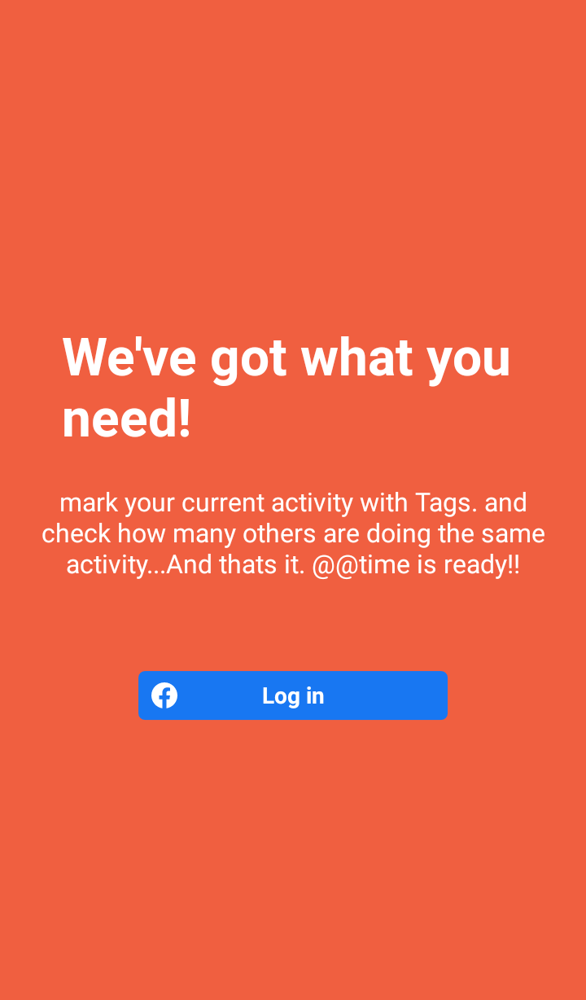

<h2>Facebook Login</h2>
</img>
</img>

Start Metro server
=============================
react-native start --port=8088

Run App
==================
react-native run-android --port=8088

Create new project
========================================
npx react-native init Timestamping

1. React native navigation installtion
https://reactnavigation.org/docs/getting-started/

3. FB-SDK Guide:
https://developers.facebook.com/docs/android/getting-started/

4. Firebase packages:
npm i firebase @react-native-firebase/app @react-native-firebase/database @react-native-firebase/messaging

5. Firebase Realtime DB Usage:
https://rnfirebase.io/database/usage

6. Firebase Send push Notification:
https://www.inkoop.io/blog/how-to-send-push-notifications-to-specific-devices-in-react-native-using-firebase/

COMMON ERRORS
===================
1. ADB error on emulator when you start the app first time. Goto project root dir and then
adb reverse tcp:8088 tcp:8088

2. Some Cache issue. Goto project root dir and then
npm cache clean -f

3.* What went wrong:
Execution failed for task ':app:processDebugResources'.
> A failure occurred while executing com.android.build.gradle.internal.tasks.Workers$ActionFacade
   > Unable to delete directory 'C:\dhruv-react-native-workspace\atatime\android\app\build\generated\not_namespaced_r_class_sources\debug\r\androidx\lifecycle' after 10 attempts

Goto project root dir
cd android
gradlew clean
cd ..
react-native run-android  --port=8088

4. JVM agrs
add this entry in gradle.properties
org.gradle.jvmargs=-Xmx4608m

5. Some multiDexEnabled error
Addd multiDexEnabled true
in build.gradle

 defaultConfig {
        applicationId "com.atatime"
        minSdkVersion rootProject.ext.minSdkVersion
        targetSdkVersion rootProject.ext.targetSdkVersion
        versionCode 1
        versionName "1.0"
        multiDexEnabled true
    }

7. Signed APK for Android in React-native
https://reactnative.dev/docs/signed-apk-android

8. Build .aab: gradlew bundleRelease
Build .apk: gradlew assembleRelease

9. 
======================================================
Key Hashes for Facebook Login: Concept explained
======================================================
By default there a DEBUG keystore available, so you dont need to create new for debugging purposes.
keytool -exportcert -alias atatime -keystore debug.keystore | openssl sha1 -binary | openssl base64
(default password: android)

1. But when deploying in prod-mode, you have to generate a keystore for your application. A keystore can have multiple private keys each with a unique alias.

keytool -genkeypair -v -keystore any-name-for-your-keystore.keystore -alias any-name-for-your-private-key -keyalg RSA -keysize 2048 -validity 10000

example: 
keytool -genkeypair -v -keystore atatime.keystore -alias atatime -keyalg RSA -keysize 2048 -validity 10000

Copy the generated .keystore file to /android/app directory. There are more steps after this for which you can follow point 7 above. These steps make your keystore as release level keystore and your key as release key. Any hashes generated using this keystore+private key will be called release hashes.

2. For signing an app or generating a new hash, you need to utilize the release-keystore+release-key which you generated in step1.
keytool -exportcert -alias alias-which-you-used-in-step1 -keystore full-path-of-the-keystore-file-kept-under-android/app | openssl sha1 -binary | openssl base64
 
 example:
 keytool -exportcert -alias atatime -keystore C:\dhruv-react-native-workspace\react-native-apps\atatime\android\app\atatime.keystore | openssl sha1 -binary | openssl base64
 
 Copy the unique key-hash generated to developers.facebook.com -> basic settings

google-services.json
===========================
Check if project url is present else add:
"firebase_url": "https://timestamps-aaddf-default-rtdb.firebaseio.com"

changes in MainActivity.java
======================================
import com.facebook.react.ReactActivityDelegate;
import com.facebook.react.ReactRootView;
import com.swmansion.gesturehandler.react.RNGestureHandlerEnabledRootView;

@Override
  protected ReactActivityDelegate createReactActivityDelegate() {
    return new ReactActivityDelegate(this, getMainComponentName()) {
      @Override
      protected ReactRootView createRootView() {
       return new RNGestureHandlerEnabledRootView(MainActivity.this);
      }
    };
  }
  
  
Vector icons not showing
===================================
react-native link react-native-vector-icons
  
  
In AndroidManifest.xml
=================================
NFC related changes
<uses-permission android:name="android.permission.NFC" />
<intent-filter>
	<action android:name="android.intent.action.VIEW" />
	<category android:name="android.intent.category.DEFAULT" />
	<category android:name="android.intent.category.BROWSABLE" />
	<data android:scheme="timestamp" android:host="toggle"/>
</intent-filter>

<intent-filter>
	<action android:name="android.nfc.action.NDEF_DISCOVERED"/>
	<category android:name="android.intent.category.DEFAULT"/>
</intent-filter>

<intent-filter>
	<action android:name="android.nfc.action.TECH_DISCOVERED"/>
</intent-filter>

FB Login related changes(will be told in setup wizard):
<meta-data android:name="com.facebook.sdk.ApplicationId" android:value="@string/facebook_app_id"/>

FB Login related changes In strings.xml(will be told in setup wizard)
====================================
<string name="facebook_app_id">209034510719349</string>
<string name="fb_login_protocol_scheme">fb209034510719349</string>

Gradle related changes(quite important and confusing)
=========================================================
For Firebase DB(Given in setup wizard):
Project-level build.gradle (<project>/build.gradle):
buildscript {
  repositories {
    // Check that you have the following line (if not, add it):
    google()  // Google's Maven repository
  }
  dependencies {
    ...
    // Add this line
    classpath 'com.google.gms:google-services:4.3.5'
  }
}

allprojects {
  ...
  repositories {
    // Check that you have the following line (if not, add it):
    google()  // Google's Maven repository
    ...
  }
}
App-level build.gradle (<project>/<app-module>/build.gradle):
apply plugin: 'com.android.application'
// Add this line
apply plugin: 'com.google.gms.google-services'

dependencies {
  // Import the Firebase BoM
  implementation platform('com.google.firebase:firebase-bom:27.1.0')
    implementation 'com.google.firebase:firebase-database'

  // Add the dependencies for the desired Firebase products
  // https://firebase.google.com/docs/android/setup#available-libraries
}

For FB Login:
Project-level build.gradle (<project>/build.gradle):
buildscript {
    ext {
        buildToolsVersion = "29.0.3"
        minSdkVersion = 21
        compileSdkVersion = 29
        targetSdkVersion = 29
        ndkVersion = "20.1.5948944"
    }
    repositories {
        mavenCentral()			//ADD THIS
        google()
        jcenter()
    }

App-level build.gradle (<project>/<app-module>/build.gradle):

dependencies {
    implementation fileTree(dir: "libs", include: ["*.jar"])
    //noinspection GradleDynamicVersion
    implementation "com.facebook.react:react-native:+"  // From node_modules
    implementation 'com.facebook.android:facebook-android-sdk:[5,6)'			//ADD THIS
